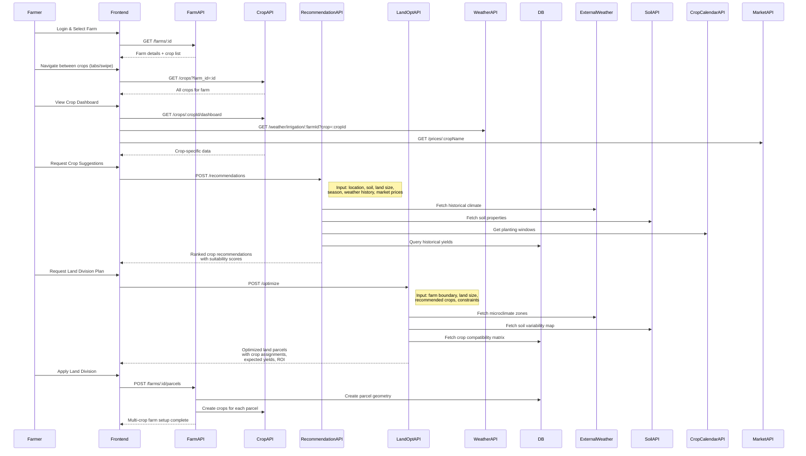
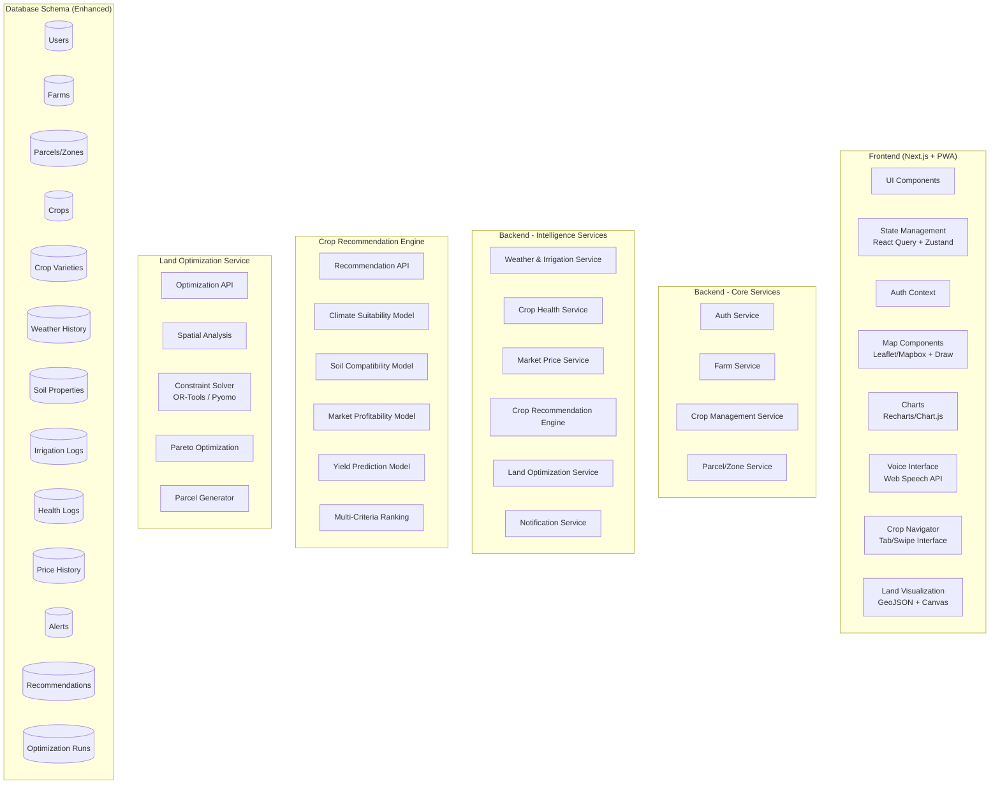
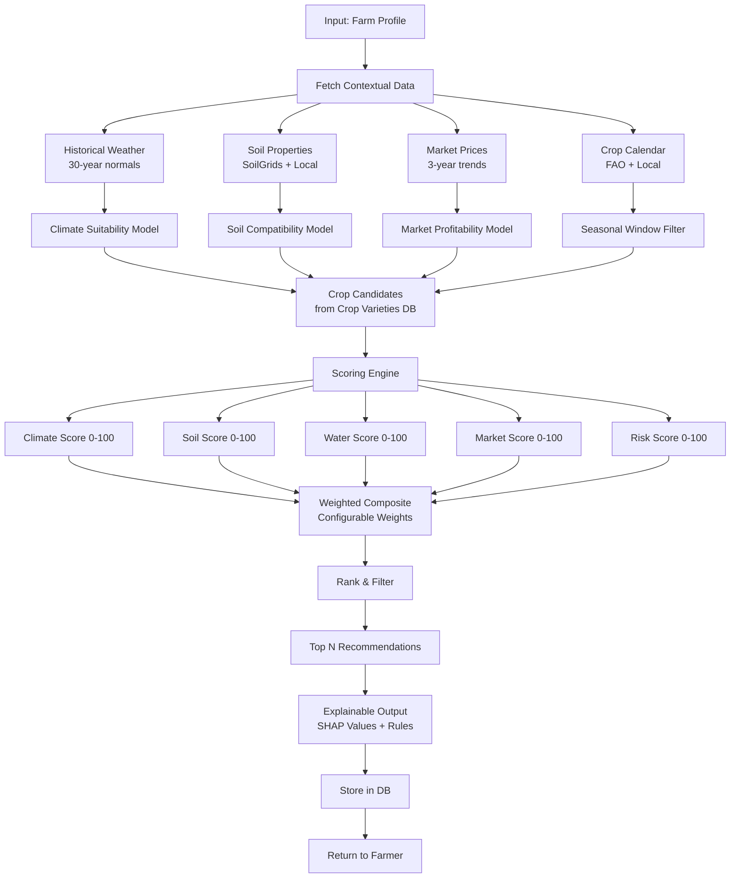
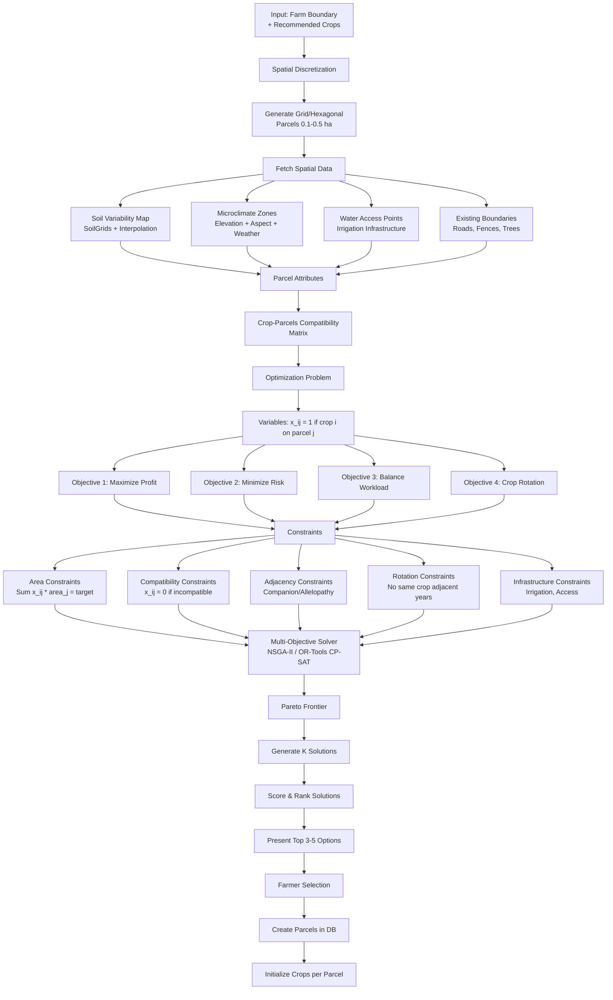
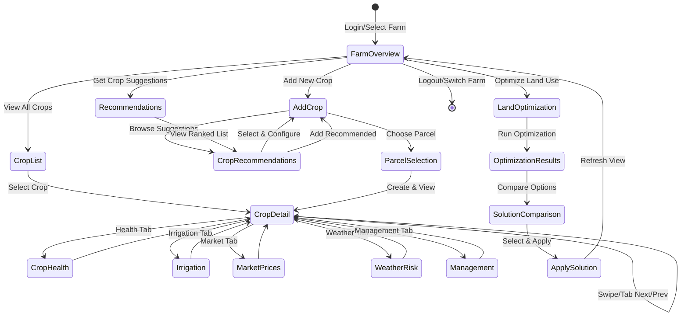
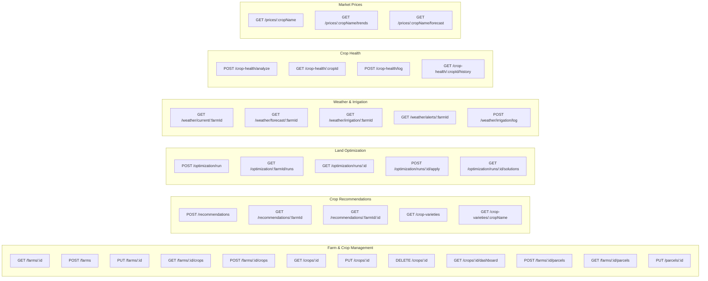

# Smart Farm Decision Support System - Enhanced Architecture Diagram

> ### ⚠️ Superseded — early design exploration
>
> This document describes an **earlier, more ambitious architecture** that was
> scoped down before implementation. It references PostgreSQL/PostGIS,
> TimescaleDB, Redis, MinIO, Celery, ONNX and a separate Python service — none
> of which are in the delivered system.
>
> **The current architecture is
> [`architecture-diagram.png`](./architecture-diagram.png)**, with the rationale
> in the [main README](../README.md).
>
> Kept for reference: it shows the design space that was considered, and
> several ideas here (community outbreak alerts, yield prediction) are tracked
> as future scope.

## High-Level System Architecture (Enhanced with Multi-Crop & AI Optimization)

```mermaid
graph TB
    subgraph "Client Layer"
        A[Farmer Mobile App<br/>React Native / PWA]
        B[Farmer Web Dashboard<br/>React.js / Next.js]
        C[Voice Interface<br/>Regional Languages]
    end

    subgraph "API Gateway / Load Balancer"
        D[NGINX / AWS ALB]
    end

    subgraph "Backend Services - Core"
        E[Auth Service<br/>Node.js/Express + JWT]
        F[Farm Profile Service<br/>Node.js/Express]
        G[Crop Management Service<br/>Node.js/Express]
    end

    subgraph "Backend Services - Intelligence"
        H[Weather & Irrigation Service<br/>Python/FastAPI]
        I[Crop Health Service<br/>Python/FastAPI + ML]
        J[Market Price Service<br/>Node.js/Express]
        K[Crop Recommendation Engine<br/>Python/FastAPI + ML]
        L[Land Optimization Service<br/>Python/FastAPI + OR-Tools]
        M[Notification Service<br/>Node.js/Express]
    end

    subgraph "Data Layer"
        N[(PostgreSQL<br/>Primary DB)]
        O[(Redis<br/>Cache & Sessions)]
        P[(S3 / MinIO<br/>Image Storage)]
        Q[(TimescaleDB<br/>Weather/Price Time Series)]
        R[(PostGIS<br/>Spatial Data)]
    end

    subgraph "External APIs"
        S[OpenWeatherMap API<br/>Weather Data]
        T[WeatherAPI.com<br/>Agriculture Weather]
        U[Plant.id API<br/>Crop Disease Detection]
        V[Agmarknet / Govt APIs<br/>Market Prices]
        W[Open-Meteo<br/>Free Weather Backup]
        X[SoilGrids / ISRIC<br/>Soil Data]
        Y[FAO Crop Calendar<br/>Crop Seasons]
    end

    subgraph "Background Jobs"
        Z[Weather Sync Worker<br/>Cron: Every 3 hours]
        AA[Price Sync Worker<br/>Cron: Daily]
        AB[Alert Generator<br/>Real-time]
        AC[Crop Recommendation Refresh<br/>Seasonal]
        AD[Land Optimization Runner<br/>On-demand]
    end

    A --> D
    B --> D
    C --> D
    D --> E
    D --> F
    D --> G
    D --> H
    D --> I
    D --> J
    D --> K
    D --> L
    D --> M

    E --> N
    E --> O
    F --> N
    F --> R
    G --> N
    H --> N
    H --> Q
    H --> S
    H --> T
    H --> W
    I --> N
    I --> P
    I --> U
    J --> N
    J --> Q
    J --> V
    K --> N
    K --> Q
    K --> X
    K --> Y
    K --> S
    K --> T
    L --> N
    L --> R
    L --> Q
    L --> X
    M --> N
    M --> O

    Z --> H
    AA --> J
    AB --> M
    AB --> H
    AB --> I
    AC --> K
    AD --> L
```



## Multi-Crop Navigation & Data Flow



## Enhanced Component Architecture



## Enhanced Database Schema

```mermaid
erDiagram
    USERS ||--o{ FARMS : owns
    FARMS ||--o{ PARCELS : contains
    FARMS ||--o{ CROPS : grows
    PARCELS ||--o{ CROPS : assigned
    PARCELS ||--o{ SOIL_DATA : has
    CROPS ||--o{ CROP_VARIETIES : has
    CROPS ||--o{ WEATHER_DATA : records
    CROPS ||--o{ IRRIGATION_LOGS : logs
    CROPS ||--o{ HEALTH_LOGS : monitors
    CROPS ||--o{ PRICE_HISTORY : tracks
    FARMS ||--o{ ALERTS : receives
    FARMS ||--o{ RECOMMENDATIONS : gets
    FARMS ||--o{ OPTIMIZATION_RUNS : runs

    USERS {
        uuid id PK
        string email UK
        string password_hash
        string name
        string phone
        string language
        jsonb preferences
        timestamp created_at
        timestamp updated_at
    }

    FARMS {
        uuid id PK
        uuid user_id FK
        string name
        geometry boundary POLYGON
        point centroid
        decimal total_area_hectares
        string soil_type_primary
        jsonb soil_analysis
        string address
        jsonb metadata
        timestamp created_at
        timestamp updated_at
    }

    PARCELS {
        uuid id PK
        uuid farm_id FK
        string name
        geometry boundary POLYGON
        decimal area_hectares
        string soil_type
        jsonb soil_properties
        string assigned_crop_id FK
        string irrigation_zone
        jsonb microclimate
        integer display_order
        timestamp created_at
        timestamp updated_at
    }

    CROPS {
        uuid id PK
        uuid farm_id FK
        uuid parcel_id FK
        string crop_name
        string variety_id FK
        date planting_date
        date expected_harvest_date
        string growth_stage
        string status
        jsonb management_plan
        decimal expected_yield_kg
        decimal actual_yield_kg
        timestamp created_at
        timestamp updated_at
    }

    CROP_VARIETIES {
        uuid id PK
        string crop_name
        string variety_name
        jsonb climate_requirements
        jsonb soil_requirements
        integer growing_days
        decimal water_requirement_mm
        jsonb disease_resistance
        jsonb market_info
    }

    WEATHER_DATA {
        uuid id PK
        uuid farm_id FK
        uuid parcel_id FK
        timestamp recorded_at
        decimal temperature_min
        decimal temperature_max
        decimal temperature_avg
        decimal humidity
        decimal rainfall
        decimal wind_speed
        decimal solar_radiation
        decimal soil_moisture
        decimal et0
        jsonb raw_data
    }

    SOIL_DATA {
        uuid id PK
        uuid parcel_id FK
        timestamp sampled_at
        decimal ph
        decimal nitrogen
        decimal phosphorus
        decimal potassium
        decimal organic_carbon
        string texture_class
        decimal bulk_density
        jsonb micronutrients
        geometry location POINT
    }

    IRRIGATION_LOGS {
        uuid id PK
        uuid crop_id FK
        uuid parcel_id FK
        timestamp irrigated_at
        decimal water_amount_mm
        string irrigation_method
        string guidance_source
        boolean was_recommended
        jsonb weather_context
    }

    HEALTH_LOGS {
        uuid id PK
        uuid crop_id FK
        uuid parcel_id FK
        timestamp observed_at
        string observation_type
        text description
        string image_url
        jsonb analysis_result
        string disease_detected
        string pest_detected
        string severity
        string status
        jsonb recommended_actions
    }

    PRICE_HISTORY {
        uuid id PK
        uuid crop_variety_id FK
        date price_date
        decimal min_price
        decimal max_price
        decimal modal_price
        string market_name
        string state
        string district
        string unit
        string quality_grade
    }

    ALERTS {
        uuid id PK
        uuid farm_id FK
        uuid parcel_id FK
        uuid crop_id FK
        string alert_type
        string severity
        text message
        jsonb metadata
        boolean is_read
        boolean is_dismissed
        timestamp created_at
        timestamp expires_at
    }

    RECOMMENDATIONS {
        uuid id PK
        uuid farm_id FK
        string crop_name
        string variety_name
        decimal suitability_score
        decimal climate_score
        decimal soil_score
        decimal market_score
        decimal water_score
        jsonb reasoning
        jsonb expected_outcomes
        string season
        timestamp created_at
    }

    OPTIMIZATION_RUNS {
        uuid id PK
        uuid farm_id FK
        jsonb input_parameters
        jsonb pareto_solutions
        jsonb selected_solution
        jsonb parcels_plan
        decimal total_expected_revenue
        decimal total_expected_cost
        decimal total_expected_profit
        string status
        timestamp created_at
        timestamp completed_at
    }
```

## Crop Recommendation Engine - Algorithm Design



## Land Optimization Service - Algorithm Design



## Multi-Crop Dashboard Navigation Flow



## API Endpoints - Enhanced


