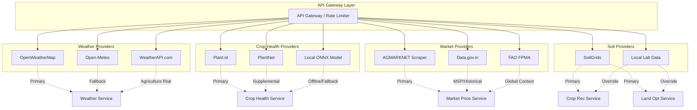
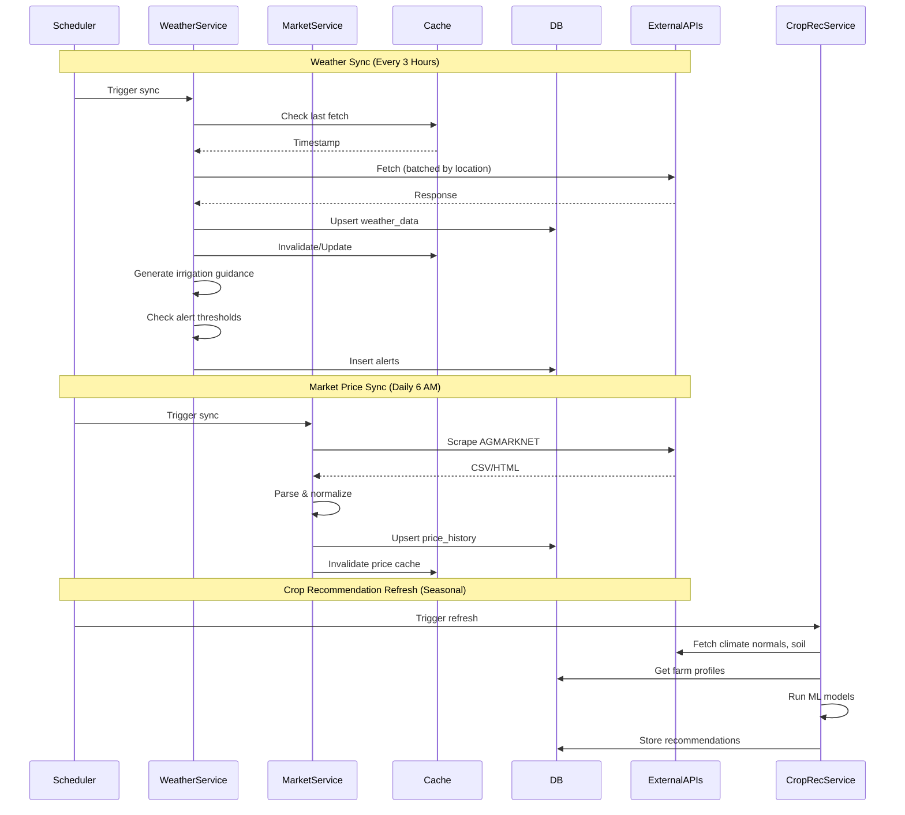

# Technology Stack & Third-Party API Selection

> ### ⚠️ Planning document — records the evaluation, not the final build
>
> This is the **research and options analysis** carried out before implementation.
> It deliberately surveys more candidates than were adopted, and several
> components described here were evaluated and then **rejected** as
> over-engineered for the problem.
>
> **What was actually built** is documented in the
> [main README](../README.md) and shown in
> [`architecture/architecture-diagram.png`](../architecture/architecture-diagram.png).
>
> Key decisions that changed after this document was written:
>
> | This document proposed                       | Shipped instead                            | Why                                                                                                                                                                 |
> | -------------------------------------------- | ------------------------------------------ | ------------------------------------------------------------------------------------------------------------------------------------------------------------------- |
> | OpenWeatherMap One Call 3.0 (primary)        | **Open-Meteo**                             | One Call 3.0 requires a credit card on file even on the free tier — an unacceptable failure point for a graded demo. Open-Meteo also publishes FAO-56 ET₀ directly. |
> | PostgreSQL + PostGIS + TimescaleDB           | **MongoDB**                                | PostGIS geometry types are unsupported by Prisma; a farm location only ever needs lat/lon.                                                                          |
> | Separate Python/FastAPI intelligence service | **Folded into Node**                       | The water balance and diagnostic engine are deterministic rule systems needing no ML runtime. Removed a network hop, a deployment target and a failure mode.        |
> | Plant.id as primary crop-health analysis     | **Rule engine primary, Plant.id optional** | See the README for the full justification — explainability and honest degradation mattered more than a black-box classifier.                                        |
> | Redis, MinIO, Celery, ONNX, k3s              | **Dropped**                                | Out of scope for the problem statement; each added operational risk without serving a must-have requirement.                                                        |
>
> The API evaluation sections below remain accurate and are the reasoning behind
> the final choices.

## Technology Stack

### Frontend

| Component            | Technology                             | Version           | Justification                                                                |
| -------------------- | -------------------------------------- | ----------------- | ---------------------------------------------------------------------------- |
| Framework            | Next.js                                | 14.x (App Router) | SSR/SSG for SEO, excellent performance, PWA support, React Server Components |
| Language             | TypeScript                             | 5.x               | Type safety, better DX, catches bugs early                                   |
| State Management     | TanStack Query (React Query) + Zustand | 5.x / 4.x         | Server state + client state separation, caching, optimistic updates          |
| UI Components        | Radix UI + Tailwind CSS                | Latest            | Accessible, unstyled primitives + utility-first CSS, responsive by default   |
| Maps                 | Leaflet + React-Leaflet                | 1.9.x / 4.x       | Open-source, lightweight, works offline with tiles, PostGIS compatible       |
| Charts               | Recharts                               | 2.x               | Composable, responsive, TypeScript native                                    |
| Forms                | React Hook Form + Zod                  | 7.x / 3.x         | Performant, validation schema sharing with backend                           |
| PWA                  | next-pwa                               | 5.x               | Workbox-based, offline-first, background sync                                |
| Voice                | Web Speech API + SpeechSynthesis       | Native            | No extra dependency, regional language support                               |
| Internationalization | next-intl                              | 3.x               | Route-based i18n, ICU message format, RTL support                            |

### Backend - Core Services (Node.js/Express)

| Component    | Technology                    | Version      | Justification                                                 |
| ------------ | ----------------------------- | ------------ | ------------------------------------------------------------- |
| Runtime      | Node.js                       | 20.x LTS     | Long-term support, excellent ecosystem                        |
| Framework    | Express.js                    | 4.x          | Lightweight, flexible, massive middleware ecosystem           |
| Language     | TypeScript                    | 5.x          | Shared types with frontend, type-safe API contracts           |
| Auth         | JWT (jsonwebtoken) + bcryptjs | 9.x / 2.x    | Stateless, scalable, industry standard                        |
| Validation   | Zod                           | 3.x          | Schema validation, TypeScript inference, shared with frontend |
| Database ORM | Prisma                        | 5.x          | Type-safe DB access, migrations, excellent DX                 |
| Cache        | ioredis                       | 5.x          | Redis client, cluster support, pub/sub                        |
| File Upload  | Multer + Sharp                | 1.x / 0.33.x | Multipart handling, image processing/optimization             |
| Logging      | Pino                          | 8.x          | Fast, structured JSON logging                                 |
| API Docs     | tsoa / Swagger                | 6.x          | Generate OpenAPI spec from TypeScript controllers             |

### Backend - Intelligence Services (Python/FastAPI)

| Component    | Technology                  | Version   | Justification                                                          |
| ------------ | --------------------------- | --------- | ---------------------------------------------------------------------- |
| Framework    | FastAPI                     | 0.109.x   | High performance, auto OpenAPI, async, Pydantic validation             |
| ML/Data      | scikit-learn, pandas, numpy | Latest    | Mature ML, data manipulation, numerical computing                      |
| Optimization | OR-Tools (CP-SAT)           | 9.x       | Google's constraint solver, world-class for combinatorial optimization |
| Spatial      | GeoPandas, Shapely, PyProj  | Latest    | Geospatial operations, CRS handling, PostGIS integration               |
| Weather      | meteostat, pvlib            | Latest    | Historical weather, solar position calculations                        |
| Task Queue   | Celery + Redis              | 5.x / 5.x | Distributed task queue, periodic tasks, scaling                        |
| ML Serving   | ONNX Runtime                | 1.18.x    | Fast inference, cross-platform, model optimization                     |

### Database

| Database             | Purpose                                 | Version    | Justification                                                  |
| -------------------- | --------------------------------------- | ---------- | -------------------------------------------------------------- |
| PostgreSQL + PostGIS | Primary DB, spatial data                | 16.x / 3.4 | ACID, mature, PostGIS for geometry, JSONB for flexible schemas |
| TimescaleDB          | Time-series (weather, prices)           | 2.13.x     | PostgreSQL extension, automatic partitioning, compression      |
| Redis                | Cache, sessions, pub/sub, Celery broker | 7.x        | Sub-ms latency, pub/sub, streams, LRU eviction                 |
| MinIO / S3           | Image/object storage                    | Latest     | S3-compatible, self-hostable, erasure coding                   |

### Infrastructure & DevOps

| Component        | Technology                     | Justification                                         |
| ---------------- | ------------------------------ | ----------------------------------------------------- |
| Containerization | Docker + Docker Compose        | Consistent environments, easy deployment              |
| Orchestration    | Kubernetes (k3s for hackathon) | Self-hosted, lightweight, auto-scaling                |
| CI/CD            | GitHub Actions                 | Native GitHub integration, free for public repos      |
| Monitoring       | Prometheus + Grafana           | Industry standard, powerful dashboards                |
| Logging          | Loki + Promtail                | Log aggregation, Label-based, integrates with Grafana |
| Reverse Proxy    | NGINX                          | SSL termination, load balancing, rate limiting        |
| SSL              | Let's Encrypt (Certbot)        | Free, automated certificates                          |

---

## Third-Party API Selection & Justification

### 1. Weather & Agriculture Data APIs

#### Primary: **OpenWeatherMap One Call API 3.0**

| Aspect                    | Details                                                                                                       |
| ------------------------- | ------------------------------------------------------------------------------------------------------------- |
| **Endpoint**              | `https://api.openweathermap.org/data/3.0/onecall`                                                             |
| **Data Provided**         | Current, minutely (1h), hourly (48h), daily (8d), alerts, historical                                          |
| **Agriculture Relevance** | Soil temperature, soil moisture, ET0, dew point, UV index, precipitation probability                          |
| **Pricing**               | Free tier: 1,000 calls/day; Paid: $0.12/1000 calls                                                            |
| **Why Chosen**            | Most comprehensive free tier, agriculture-specific parameters (soil moisture, ET0), global coverage, reliable |
| **Integration**           | Backend weather service, cached for 1 hour, fallback to Open-Meteo                                            |

#### Secondary (Backup): **Open-Meteo**

| Aspect            | Details                                                                                  |
| ----------------- | ---------------------------------------------------------------------------------------- |
| **Endpoint**      | `https://api.open-meteo.com/v1/forecast`                                                 |
| **Data Provided** | Hourly/daily forecasts, historical, climate normals, agriculture variables               |
| **Pricing**       | Completely free, no API key required                                                     |
| **Why Chosen**    | No rate limits for reasonable use, agriculture variables (ET0, soil moisture), open data |
| **Integration**   | Fallback when OpenWeatherMap fails or quota exceeded                                     |

#### Agriculture-Specific: **WeatherAPI.com**

| Aspect            | Details                                                                   |
| ----------------- | ------------------------------------------------------------------------- |
| **Endpoint**      | `http://api.weatherapi.com/v1/forecast.json`                              |
| **Data Provided** | Agriculture forecast, pest/disease risk, growing degree days, chill hours |
| **Pricing**       | Free: 1M calls/month; Paid: $4/month for 300k calls                       |
| **Why Chosen**    | Purpose-built for agriculture, pest/disease risk models, GDD tracking     |
| **Integration**   | Crop health risk alerts, irrigation timing refinement                     |

### 2. Crop Health / Disease Detection APIs

#### Primary: **Plant.id API (by Kindwise)**

| Aspect           | Details                                                                              |
| ---------------- | ------------------------------------------------------------------------------------ |
| **Endpoint**     | `https://api.plant.id/v2/health_assessment`                                          |
| **Capabilities** | Disease identification (100+), pest detection, health scoring, treatment suggestions |
| **Input**        | Base64 image or URL, optional crop name for context                                  |
| **Output**       | Disease name, probability, classification, treatment, prevention                     |
| **Pricing**      | Free: 100 requests/day; Paid: $0.01/request                                          |
| **Why Chosen**   | Purpose-built for plants, high accuracy, treatment guidance, supports many crops     |
| **Integration**  | Crop health service, async processing, results cached                                |

#### Backup/Supplement: **PlantNet API**

| Aspect           | Details                                                |
| ---------------- | ------------------------------------------------------ |
| **Endpoint**     | `https://my-api.plantnet.org/v2/identify/all`          |
| **Capabilities** | Plant identification, disease classification (limited) |
| **Pricing**      | Free for research/education                            |
| **Why Chosen**   | Open, community-driven, good for crop identification   |
| **Integration**  | Crop variety verification, supplemental identification |

#### Local ML Model (Offline-First):

| Approach        | Details                                                                         |
| --------------- | ------------------------------------------------------------------------------- |
| **Model**       | MobileNetV3 / EfficientNet-B0 fine-tuned on PlantVillage + Indian crop diseases |
| **Format**      | ONNX for cross-platform inference                                               |
| **Deployment**  | ONNX Runtime in Python service, TensorFlow.js for frontend offline              |
| **Why**         | Works offline, no API costs, privacy-preserving, customizable for local crops   |
| **Integration** | Primary for offline mode, fallback for API failures                             |

### 3. Market Price Data APIs

#### Primary: **AGMARKNET (Government of India)**

| Aspect          | Details                                                               |
| --------------- | --------------------------------------------------------------------- |
| **Source**      | `https://agmarknet.gov.in/` - Official agricultural marketing portal  |
| **Data**        | Daily wholesale prices for 300+ commodities across 3000+ markets      |
| **Access**      | Web scraping (no official API) / CSV download / Some states have APIs |
| **Coverage**    | India-wide, mandi-level, variety-grade specific                       |
| **Cost**        | Free (public data)                                                    |
| **Why Chosen**  | Authoritative source for India, comprehensive coverage, free          |
| **Integration** | Daily ETL job, stored in TimescaleDB, served via Market Price Service |

#### Secondary: **Data.gov.in / Open Government Data**

| Aspect         | Details                                                   |
| -------------- | --------------------------------------------------------- |
| **Source**     | `https://data.gov.in/` - Various datasets                 |
| **Data**       | Historical prices, arrivals, minimum support prices (MSP) |
| **Access**     | API (CKAN) or CSV download                                |
| **Cost**       | Free                                                      |
| **Why Chosen** | Official MSP data, historical trends, policy prices       |

#### Global Fallback: **FAO FPMA / World Bank Pink Sheet**

| Aspect         | Details                                       |
| -------------- | --------------------------------------------- |
| **Source**     | FAO Food Price Monitoring and Analysis        |
| **Data**       | International commodity prices, global trends |
| **Access**     | API / CSV                                     |
| **Cost**       | Free                                          |
| **Why Chosen** | Global context, export/import parity prices   |

### 4. Soil Data APIs

#### Primary: **SoilGrids / ISRIC**

| Aspect           | Details                                                          |
| ---------------- | ---------------------------------------------------------------- |
| **Endpoint**     | `https://rest.isric.org/soilgrids/v2.0/properties/query`         |
| **Data**         | pH, N, P, K, OC, texture, bulk density, CEC at 250m resolution   |
| **Depth Layers** | 0-5, 5-15, 15-30, 30-60, 60-100, 100-200 cm                      |
| **Cost**         | Free for non-commercial                                          |
| **Why Chosen**   | Global coverage, standardized, multiple depths, machine-readable |
| **Integration**  | Land optimization service, crop recommendation engine            |

#### Secondary: **Local Soil Testing Labs / ICAR**

| Aspect          | Details                                               |
| --------------- | ----------------------------------------------------- |
| **Source**      | ICAR-KVK network, state agricultural universities     |
| **Data**        | Farmer-submitted soil test reports                    |
| **Integration** | Manual entry or API if available, overrides SoilGrids |

### 5. Crop Calendar / Agronomy Data

#### Primary: **FAO Crop Calendar**

| Aspect         | Details                                                            |
| -------------- | ------------------------------------------------------------------ |
| **Source**     | `https://www.fao.org/agriculture/seed/cropcalendar`                |
| **Data**       | Planting/harvesting windows by country, crop, agro-ecological zone |
| **Cost**       | Free                                                               |
| **Why Chosen** | Authoritative, globally validated, zone-specific                   |

#### Secondary: **ICAR / State Agriculture Dept. Calendars**

| Aspect         | Details                                                           |
| -------------- | ----------------------------------------------------------------- |
| **Source**     | ICAR-CRIDA, State Agricultural Universities                       |
| **Data**       | Region-specific varieties, planting windows, package of practices |
| **Why Chosen** | Local relevance, variety-specific, includes input recommendations |

---

## API Integration Architecture

---

## Rate Limiting & Cost Management

| API            | Free Tier | Estimated Daily Calls       | Cost/Month (Projected)    | Strategy                              |
| -------------- | --------- | --------------------------- | ------------------------- | ------------------------------------- |
| OpenWeatherMap | 1,000/day | 500 (50 farms × 10 calls)   | $0 (free tier sufficient) | Cache 1hr, batch requests             |
| WeatherAPI.com | 1M/month  | 1,500 (50 farms × 30 calls) | $0 (free tier sufficient) | Cache 3hr, agriculture endpoints only |
| Plant.id       | 100/day   | 50 (50 farmers × 1 scan)    | $0 (free tier sufficient) | Queue, prioritize, cache results      |
| AGMARKNET      | Unlimited | 1,000 (scraper)             | $0                        | Respectful scraping, cache 24hr       |
| SoilGrids      | Unlimited | 100 (per optimization)      | $0                        | Cache indefinitely per coordinate     |

**Total Estimated Monthly Cost: $0-10** (well within hackathon budget)

---

## Data Flow & Synchronization Strategy

---

## Error Handling & Resilience Patterns

| Scenario                           | Strategy                    | Implementation                                      |
| ---------------------------------- | --------------------------- | --------------------------------------------------- |
| Weather API timeout                | Circuit breaker + fallback  | `opossum` circuit breaker, fallback to Open-Meteo   |
| Weather API quota exceeded         | Graceful degradation        | Use cached data, show "last updated" timestamp      |
| Crop health API failure            | Local model fallback        | Queue for retry, process with ONNX model            |
| Market data scraping fails         | Use last known prices       | Show stale data with warning, retry with backoff    |
| Soil API unavailable               | Use defaults + farmer input | Allow manual soil entry, flag as estimated          |
| Network offline (farmer)           | Offline-first PWA           | Service worker caches, background sync on reconnect |
| Database connection pool exhausted | Connection pooling + retry  | Prisma pool, exponential backoff, queue requests    |

---

## Security Considerations for API Integration

1. **API Keys**: Stored in environment variables, never in code, rotated quarterly
2. **Rate Limiting**: Per-API client-side rate limiters + server-side quotas
3. **Data Validation**: All external responses validated with Zod schemas before DB insertion
4. **PII Protection**: No farmer PII sent to external APIs (only lat/lon, crop names)
5. **Audit Logging**: All external API calls logged with request/response metadata
6. **Fail-Safe Defaults**: Conservative recommendations when data unavailable (e.g., "irrigate if unsure")
